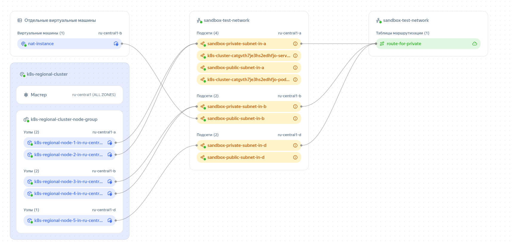

# Managed kubernetes в Yandex.Cloud

Пример создания регионального кластер в облаке (мультизональный кластер (три зоны), 5 нод), а так же деплоймента, для тестовых и практических заданий.

## ⚠️ Warning

Этот репозиторий создан в учебных целях и демонстрирует практику развёртывания и конфигурации мультизонального Kubernetes-кластера в Yandex Cloud с простым веб-приложением.
Я не являюсь опытным DevOps-инженером, а только начинаю путь в эксплуатации Kubernetes.

💸 Имейте в виду: ресурсы в Yandex.Cloud являются платными, особенно Managed Kubernetes, балансировщики и виртуальные машины. Настоятельно рекомендуется выполнять terraform destroy после тестов, чтобы избежать неожиданных затрат.

## Структура

* [**app**](app/) - **yaml манифесты для деплоя тестового приложения с комментариями:**

    ```bash
    app
    ├── deployment.yaml
    ├── hpa-pdb.yaml
    ├── ingressnginx.yaml
    ├── namespace.yaml
    ├── sa-cronjob.yaml
    └── service.yaml
    ```

* [**infra**](infra/) - манифесты Terraform, для создания следующих ресурсов:

  * [**k8s_cluster.tf**](infra/k8s_cluster.tf) - региональный (в нейминге Я. Облака) managed кластер k8s в 3 зонах доступности с 5 фиксированными нодами.
    * *Для удобства балансировки подов по зонам и чтобы убрать точку отказа (spof), лучше использовать 6 нод. Но кластер тестовый, и было ТЗ на 5:)*

  * [**net.tf**](infra/net.tf) - VPC сеть с 6 подсетями, по 2 для каждой зоны доступности (приватная + публичная). NAT инстанс. Мастера кластера находятся в публичной сети. Ноды кластера в приватной, с выходом в public через NAT инстанс:

  <p align="center"></p>

  * [**sec_group.tf**](infra/sec_group.tf) - группы безопасности для k8s кластера (публичных адресов) и дефолтная (приватные адреса).

  * [**vars.tf**](infra/vars.tf) - переменные необходимые для создания кластера

* [**infra/meta**](infra/meta) - метаданные для NAT VM и нод kubernetes (user, ssh-keys)

## Как развернуть

### Требования

* Установлены:
  * [Terraform](https://developer.hashicorp.com/terraform/install)
  * [kubectl](https://kubernetes.io/docs/tasks/tools/)
  * [Helm](https://helm.sh/docs/intro/install/)
  * Доступ к Yandex.Cloud с настроенным [CLI и сервисным аккаунтом](https://cloud.yandex.ru/docs/cli/quickstart)

---

### 🚀 Развёртывание инфраструктуры и кластера

Заполняем переменные в [**vars.tf**](infra/vars.tf)

```bash
cd infra
terraform init
terraform plan
terraform apply --auto-approve
yc managed-kubernetes cluster get-credentials --name=k8s-regional-cluster --external --force
```

### 🌐 Установка ingress-nginx

```bash
helm repo add ingress-nginx https://kubernetes.github.io/ingress-nginx
helm repo update
helm install ingress-nginx ingress-nginx/ingress-nginx \
  --namespace ingress-nginx --create-namespace

# Если используется статический IP-адрес, добавьте параметр:
# --set controller.service.loadBalancerIP=<STATIC_IP>
```

### 📦 Деплой приложения

```bash
cd ../app
kubectl apply -f namespace.yaml
kubectl apply -f deployment.yaml
kubectl apply -f service.yaml
kubectl apply -f ingressnginx.yaml
kubectl apply -f hpa-pdb.yaml
kubectl apply -f sa-cronjob.yaml
```
