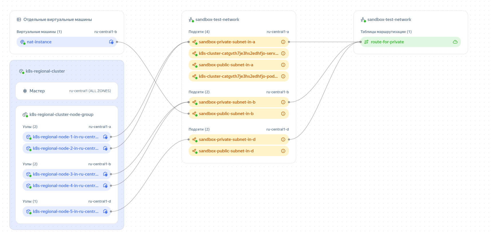

# Managed kubernetes в Yandex.Cloud

Пример создания регионального кластер в облаке для тестовых и практических заданий.

## ⚠️ Warning

Имейте в виду: ресурсы в Yandex.Cloud являются платными, особенно Managed Kubernetes, балансировщики и виртуальные машины. Настоятельно рекомендуется выполнять terraform destroy после тестов, чтобы избежать неожиданных затрат.

## Структура

* [**infra**](infra/) - манифесты Terraform, для создания следующих ресурсов:

  * [**k8s_cluster.tf**](infra/k8s_cluster.tf) - региональный managed кластер k8s в 3 зонах доступности с 6 фиксированными нодами.

  * [**net.tf**](infra/net.tf) - VPC сеть с 6 подсетями, по 2 для каждой зоны доступности (приватная + публичная). NAT инстанс:

  <p align="center"></p>

  * [**sec_group.tf**](infra/sec_group.tf) - группы безопасности для k8s кластера (публичных адресов) и дефолтная (приватные адреса).

  * [**vars.tf**](infra/vars.tf) - переменные необходимые для создания кластера

* [**infra/meta**](infra/meta) - метаданные для NAT VM и нод kubernetes (user, ssh-keys)

* [**app**](app/) - **yaml манифесты для деплоя тестового приложения:**

    ```bash
    app
    ├── deployment.yaml
    ├── hpa-pdb.yaml
    ├── ingressnginx.yaml
    ├── namespace.yaml
    ├── sa-cronjob.yaml
    └── service.yaml
    ```

## Как развернуть

### Требования

* Установлены:
  * [Terraform](https://developer.hashicorp.com/terraform/install)
  * [kubectl](https://kubernetes.io/docs/tasks/tools/)
  * [Helm](https://helm.sh/docs/intro/install/)
  * Доступ к Yandex.Cloud с настроенным [CLI и сервисным аккаунтом](https://cloud.yandex.ru/docs/cli/quickstart)

---

### Развёртывание инфраструктуры и кластера

Заполняем переменные в [**vars.tf**](infra/vars.tf)

```bash
cd infra
terraform init
terraform plan
terraform apply --auto-approve
yc managed-kubernetes cluster get-credentials --name=k8s-regional-cluster --external --force
```

### Установка ingress-nginx

```bash
helm repo add ingress-nginx https://kubernetes.github.io/ingress-nginx
helm repo update
helm install ingress-nginx ingress-nginx/ingress-nginx \
  --namespace ingress-nginx --create-namespace

# Если используется статический IP-адрес, добавьте параметр:
# --set controller.service.loadBalancerIP=<STATIC_IP>
```

### Деплой приложения

```bash
kubectl apply -f app/ --recursive 
```
